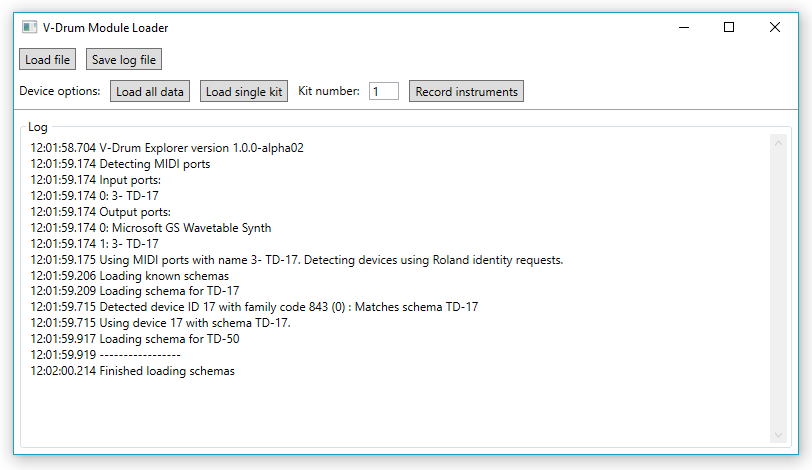
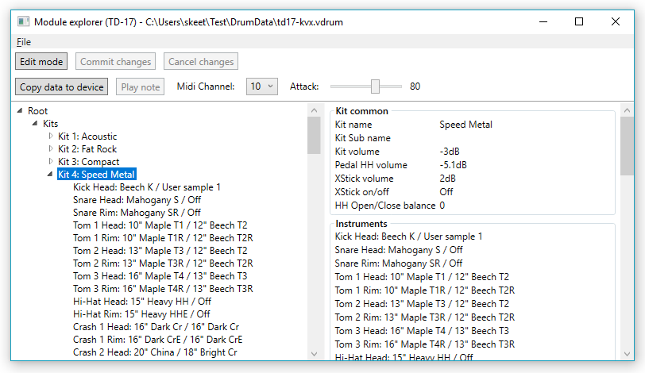
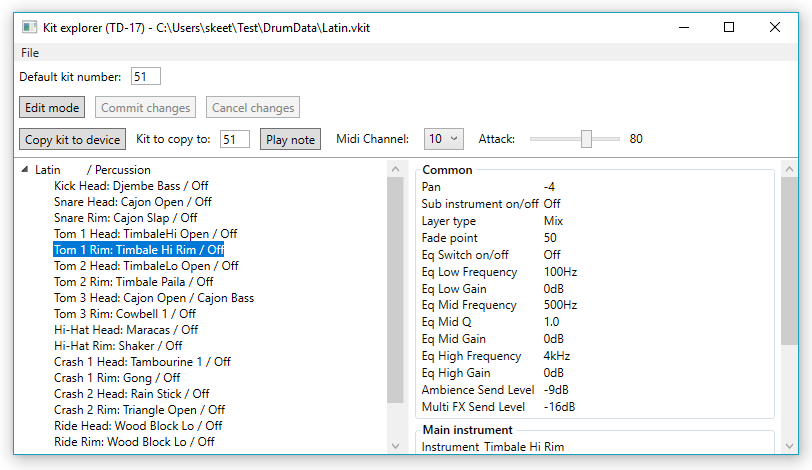

Documentation for V-Drum Explorer

All source code is in the [Drums directory of the GitHub repo](https://github.com/jskeet/DemoCode/tree/master/Drums).

# Requirements

- Windows 8.1 or Windows 10
- .NET 4.7.2 or later (I'll publish a .NET Core 3.0 build when Core 3.0 goes GA)
- To be genuinely useful, a Roland TD-17 or TD-50 V-Drums drum kit, turned on and connected via USB 

# Installation

Requirements: Windows 8.1 or Windows 10; .NET 4.7.2 or later.

There's currently no Windows installer, and it's unlikely that I'll
create one unless there's demand.

- Download a zip file from one of the [releases](https://github.com/jskeet/DemoCode/releases) on GitHub
- Unzip the zip file anywhere on your machine
- Run VDrumExplorer.Wpf.exe

# Usage

There are three windows in the application:

- Module Loader
- Module Explorer
- Kit Explorer

When the application is launched, the Module Loader will be shown.

## Module Loader

This window should be left open; closing it will close all other
windows. It also contains the log which can be saved to disk and
then included when [filing an
issue](https://github.com/jskeet/DemoCode/issues/new)

The log will include diagnostics as the application attempts to
detect a drum module. In the screenshot above, it's detected my TD-17.
If no known module is detected, the second row of buttons will be
disabled.

## "Offline" functionality (no drum module required)

Even without a drum module, you can still load and save
files, and edit the data.

Click on "Load module/kit file" to load a file. The application will
detect whether it contains data for a whole module or a single kit,
and display the appropriate window, as described later.

Click on "Save log file" to simply save the contents of the log (as
displayed in the Module Loader) to a text file. This is primarily to
make it easy to report issues. Note that this single log is used for
all logging, including for log entries created by other windows.

## "Live" functionality (drum module on and connected via USB)

If a module is detected, you can load data from it with the two
buttons in the second row:

- Load the complete data for a module with the "Load all data from device" button
- Load a single kit by entering the kit number and clicking "Load single kit from device"

When loading a single kit, the value in the "Kit number" textbox
should be an integer between 1 and 100. (If other modules are ever
supported, this range may vary.)

Loading a single kit is reasonably quick - a few seconds - but
loading the complete module data takes about three minutes for the
TD-17, and longer for the TD-50. You'll see a progress dialog like
this:

You can cancel at any time, but I strongly recommend that if you
wait until the complete module data has loaded, you then save it to
a file so you can load that next time.

## Module Explorer

The Module Explorer allows you to view and edit almost all the data
in a module. (There are some aspects that aren't available, such as
sample data.)

Information is presented in a tree view, with details of the
currently selected tree node in a panel on the right hand side.
Initially, the explorer is in read-only mode.

If no drum module was detected when the application was loaded, or
if the module isn't the same as the source of the data being shown
in the explorer (e.g. you have a TD-17 but you're exploring TD-50
data), the second row of buttons will not be present.

### Edit mode

Click "edit mode" to enable editing. You stay in edit mode even if
you change tree nodes, so you can edit multiple aspects at a time.

It's important to understand that when you're in edit mode, you're
only editing the data in memory. Nothing is automatically saved to a
file, or copied to the physical drum module. Those actions have to
be taken explicitly.

To leave edit mode, you can click on either "Commit changes" or
"Cancel changes". (This *still* only makes a difference to the data
in memory.) If you click on "Cancel changes," all the changes you
made in edit mode are reverted. If you click on "Commit changes"
you'll see the changes you made in read-only mode.

### "Overlaid" fields

Some of the data in a module is related to other data. For example,
the options available for tuning and muffling depend on the kind of
instrument you're applying them to. When you change to a different
instrument group, the application resets those related field to
*valid*, but possibly not *desirable* values. If you change back to
the original instrument group, it will reset the fields back to the
defaults for that original group - *not* to the values you had
before. Make sure you look at all the options! (It's possible that
the user experience around this will be improved over time.)

This currently applies to:

- Multifx (where the parameters available depend on the effect being
  applied)
- Instrument "vedit" parameters (tuning, muffling, sizzle, snare
buzz etc)

### Playing a note

When a drum module is connected and an instrument is selected, the
"Play note" button is enabled. This is intended to provide a
convenient way of experimenting with the settings you're editing,
but its functionality is fairly crude: it *just* tells the module to
play the selected instrument, as specified in the MIDI settings for
the kit.

Use the "attack" slider to simulate hitting the drum hard or softly.

In particular:

- If you have made any changes to the kit but not copied them to the
device, you won't hear the results of the changes.
- If the currently selected kit on the physical device isn't the
same as the one you've made changes to, you'll hear the "wrong"
instrument.

If you don't hear *anything*, check the MIDI channel used by your
module. The application defaults to 10, which is the default channel
for the TD-17.

### Copying data to the device

The "Copy data to device" button will copy all the information from
the currently selected tree node and all child nodes, onto the device.
This can be very quick if you're copying a single instrument;
copying a whole kit takes a bit longer. Copying the entire module
data (from "Root" downwards) will take a very long time.

Note that in edit mode, the data copied is what you currently see,
including any changes you've made.

### Opening a kit in Kit Explorer

If the currently selected tree node is within a kit, the "Open copy
in Kit Explorer" button will be enabled. This does exactly what it
says: it creates an independent copy of all the data for the kit
(including any in-progress changes, if you're in edit mode) and
opens up a new Kit Explorer window.

### Saving to disk

The File/Save menu item allows you to save the whole module data to
a .vdrum file, which can be opened later in Module Loader.

## Kit Explorer

Kit Explorer works very similarly to Module Explorer, except it
operates on a single kit instead of the data for a whole module.

Note that the kit will always be shown as "Kit 1" regardless of
which kit number it originally came from. Once loaded in Kit
Explorer, a kit doesn't really have a number - it's just "a kit".

### Copying the kit to the device

The "Copy kit to device" button will copy the kit data
to the kit specified in the textbox. (This must be a valid kit
number for your module.) In Kit Explorer, the whole kit data is
always copied, rather than just information from the selected tree
node.

### Saving to disk

The File/Save menu item allows you to save the kit to a .vkit file,
which can be opened later in Module Loader.

# Further work

- An icon!
- Cleaner user interface for loading or copying a single kit (the textbox is ugly)
- Kit functionality within Module Explorer:
  - Import a single kit
  - Export a single kit (equivalent to "open in kit explorer, save"
  - Copy a kit to another slot
- Potentially remember the file that was loaded, so it's easier to save over it
- Better default values when overlaid fields are reset, or
  potentially remembering previously-used values
- Stop Kit Explorer from showing "Kit 1" which is misleading